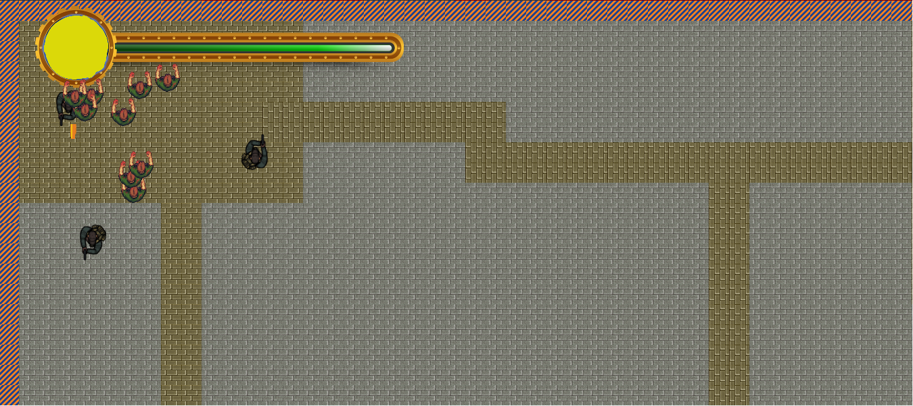

**TheLast**
======
#### **Periodo Académico: 2018-1**
#### **Curso: Arquitectura de software**
#### **Integrantes:**
 - Andres Felipe Pardo Mesa
 - Daniel Felipe Moreno D'Aleman
 - David Felipe Vaca Santana

**Enlace Heroku:**

#### **Descripción del proyecto:**
> *Este proyecto tiene como enfoque brindar al usuario entretenimiento, donde el usuario se sienta cómodo en un juego que le puede brindar experiencia multijugador e individual. THE LAST esta basado en el juego Boxhead, se generó un nuevo tipo de estrategia el cual le permite al usuario competir con sus amigos o con cualquier personas de forma online generando un ambiente competitivo.*

> **Indicaciones Básicas de uso**
>  Para empezar, el registro cuenta con 3 partes importantes:
>  - User name: Nombre con el cual el usuario se va a identificar en la pantalla.
>  - Id game: Número de partida a la cual se quiere unir.
>  - Selector de color: Color con el cual se quiere identificar.

> Al dar *click* en el Botón *PLAY* el juego va a empezar, pasando al tablero de juego.

>Luego de oprimir *click* se va apreciar el tablero de juegom junto con el player, y 3 zombies generados, por cada jugador
 que se encuentre en la partida.

>Al estar dentro de la partida, se podrá mover al jugador con las flechas del teclado en cualquier dirección,
 Se puede disparar con la tecla espacio. Ademas se puede ver la barra de vida junto con el color que se escogio
 inicialmente, 

- **Enlace Trello:** https://trello.com/b/xlSrf97p/arsw-2018-1-thelast-historias

- **Codacy:** 
